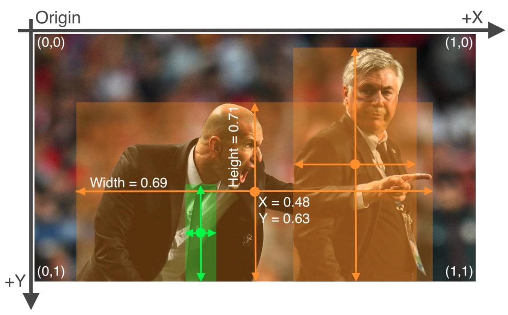

# Image dimensions

Keep in mind when reading images with opencv, images are read in matrix notation.
The dimensions of a matrix are (rows, columns) - which is (height, width) in image notation. 

Therefore, the following expression applies:

_&theta;mat<exp>T</exp>  = &theta;img 	&and; &theta;img<exp>T</exp>  = &theta;mat_ 
_where &theta;_ &ensp; &ensp;    is an Image  
&ensp; &ensp; &ensp; &ensp; _img_ &ensp;represents the image notation  
&ensp; &ensp; &ensp; &ensp; _mat_ &ensp;represents the matrix notation  

To ensure consistency throughout any image operation - **Images are always represented in image notation**.
The image reader will always return _&theta;mat<exp>T</exp>_. This should also solve the problem with opencv, 
where images are read as bgr instead of rgb.

When returning augmented images, the rgb-matrix notation is applied. Here only the first and the second image dimensions 
are transposed.

